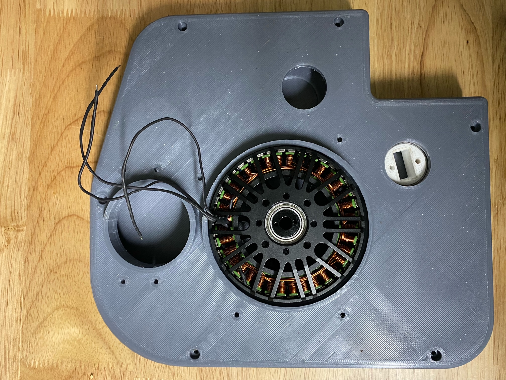
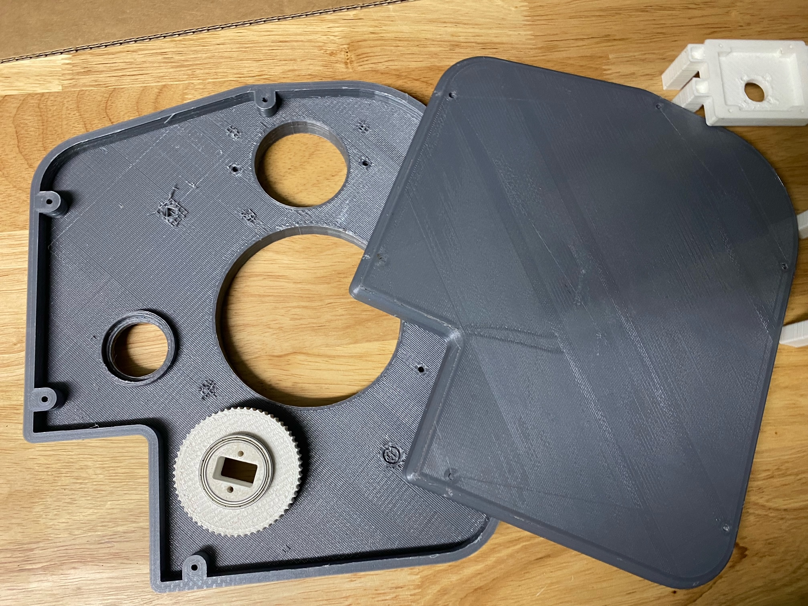

## Prototypes

This repository contains some of the initial ideas and prototypes. The most developed of these is a prototype for the hip actuator, created in solidworks by Phan Nguyen (WSU). The designs were 3d printed, and used to develop first working actuators for the project (in a separate repository).

  

